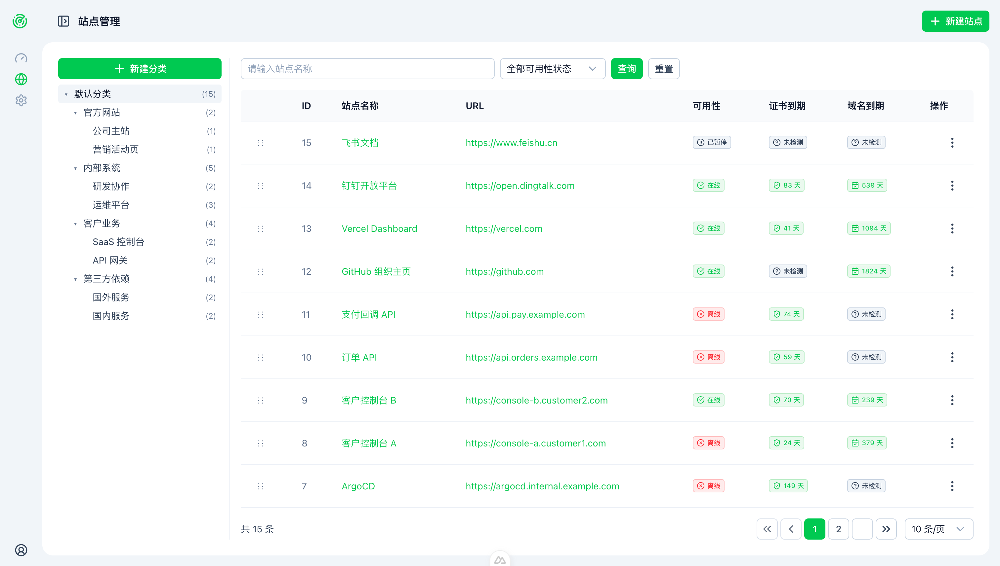
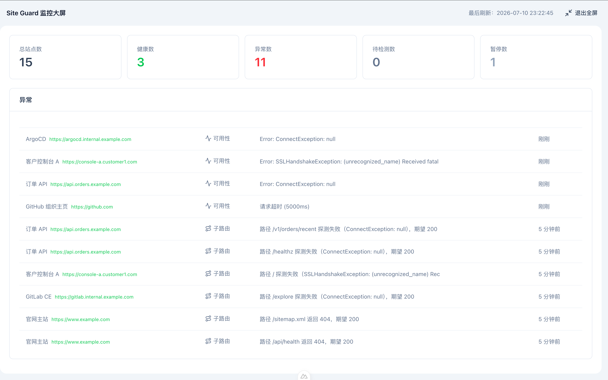

# site-guard

> 简单易用的站点监控工具 —— 几条命令部署，即可对一批站点的可用性、证书有效期、关键路径进行持续巡检，发现异常自动推送钉钉/飞书/企业微信。

站点再多、再分散，也只需维护一份 `docker-compose.yml`，登录后即可看到统一大屏；公开大屏还支持无登录共享给团队/客户。




## 主要功能

- **站点与分类管理**：按"默认分类 / 官方 / 公司 / 客户 / 第三方依赖"等维度组织站点，支持自定义分类。
- **可用性探活**：基于 HTTP 探针定时检测，自动统计"总览 / 健康 / 异常 / 待检测 / 暂停"。
- **SSL 证书到期监控**：自动解析证书剩余天数，提前发现即将过期的证书。
- **关键路径探针**：在主域名之外，对 `/healthz`、`/api/orders/recent` 等关键路径做二次校验，减少"主站 200 但业务挂了"的盲区。
- **告警通知**：站点异常或恢复时，按订阅规则推送至钉钉、飞书、企业微信等通知频道。
- **公开大屏**：只读视图，无需登录即可查看整体健康度与最近异常，适合内嵌到大屏或分享给非管理员。

## 技术栈

- **前端**: Nuxt 4 (Vue 3, TypeScript) + @nuxt/ui + Pinia
- **后端**: Spring Boot 4.0 (Java 25) + Spring Data JPA + Spring Security + Flyway
- **数据库**: MySQL 8
- **构建工具**: Gradle 9.4.1 + pnpm 10

## 快速部署（Docker Compose，推荐）

只需一份 `docker-compose.yml` + 一条命令，即可启动 MySQL 与 site-guard 全部服务。

项目根目录下已有 `docker-compose.yml`（首次使用建议先复制一份自定义）：

```yaml
# docker-compose.yml
services:
  mysql:
    image: mysql:8.4.10
    container_name: site-guard-mysql
    environment:
      MYSQL_ROOT_PASSWORD: root123456
      MYSQL_DATABASE: site-guard
      TZ: Asia/Shanghai
    command:
      - --character-set-server=utf8mb4
      - --collation-server=utf8mb4_general_ci
    ports:
      - "13306:3306"
    volumes:
      - ./data/mysql:/var/lib/mysql
    restart: unless-stopped
    healthcheck:
      test: ["CMD", "mysqladmin", "ping", "-h", "localhost", "-uroot", "-proot123456"]
      interval: 10s
      timeout: 5s
      retries: 5

  site-guard:
    build:
      context: .
      dockerfile: Dockerfile
    image: ghcr.io/sunmh207/site-guard:0.0.2
    container_name: site-guard
    ports:
      - "1080:80"
    environment:
      DB_HOST: mysql
      DB_PORT: 3306
      DB_NAME: site-guard
      DB_USER: root
      DB_PASSWORD: root123456
      # JWT 密钥需 ≥ 32 字符（256 位）以满足 HS256 算法最低要求
      # 生产环境请使用: openssl rand -base64 32
      JWT_SECRET: ChangeThisSecretKeyInProduction_7gK9xQ2mLp8Zr4VnT6cW1yHs3DfA0bJu
      JAVA_OPTS: -Xms256m -Xmx512m
      LOGGING_LEVEL_ROOT: INFO
      ADMIN_USERNAME: admin
      ADMIN_PASSWORD: admin
    volumes:
      - ./data:/app/data
      - ./logs:/app/logs
    depends_on:
      mysql:
        condition: service_healthy
    restart: unless-stopped
```

一行启动：

```bash
docker compose up -d
```

启动完成后：

- 管理后台：<http://localhost:1080>  （默认账号 `admin` / `admin`，**生产环境请立即修改**）

```bash
docker compose logs -f           # 查看实时日志
docker compose restart           # 重启服务
docker compose down              # 停止服务（保留数据卷）
```

> ⚠️ 生产环境务必：1) 修改 `MYSQL_ROOT_PASSWORD`、`JWT_SECRET`、`ADMIN_PASSWORD`；2) 移除 MySQL 的 `ports` 映射，仅暴露 site-guard；3) 配置外部持久化卷与 HTTPS。

## 本地开发

### 后端

```bash
cd server
./gradlew bootRun
```

### 前端

```bash
cd web
pnpm install
pnpm dev
```

访问：<http://localhost:3001>