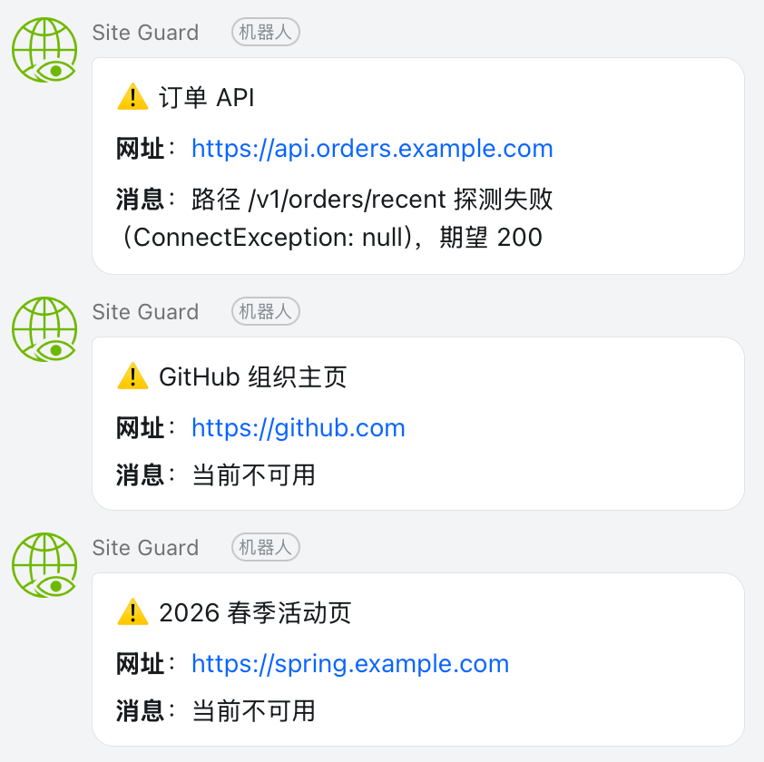

# site-guard

简单易用的站点监控工具 —— 对站点的可用性、证书有效期、关键路径进行持续巡检，发现异常自动推送钉钉/飞书/企业微信。


<p float="left">
  
</p>
## 主要功能

- **站点与分类管理**：支持自定义分类。
- **可用性探活**：基于 HTTP 探针定时检测，自动统计"总览 / 健康 / 异常 / 待检测 / 暂停"。
- **SSL 证书到期监控**：自动解析证书剩余天数，提前发现即将过期的证书。
- **关键路径探针**：在主域名之外，对 `/healthz`、`/api/orders/recent` 等关键路径做二次校验，减少"主站 200 但业务挂了"的盲区。
- **告警通知**：站点异常或恢复时，按订阅规则推送至钉钉、飞书、企业微信等通知频道。
- **公开大屏**：只读视图，无需登录即可查看整体健康度与最近异常，适合内嵌到大屏或分享给非管理员。

## 快速部署（Docker Compose）

```bash
  git clone https://github.com/sunmh207/site-guard.git
  cd site-guard
  cp .env.example .env
  docker compose up -d
```

访问管理后台：http://localhost:1080  （默认账号 admin / admin，首次登录后请立即修改）


## 本地开发

### 后端

```bash
cd server
./gradlew bootRun
```

### 前端

```bash
cd web
pnpm install
pnpm dev
```

访问：<http://localhost:3001>