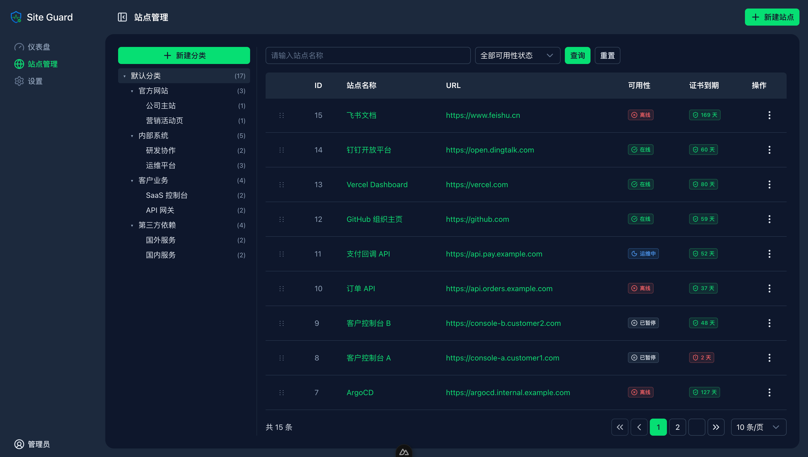
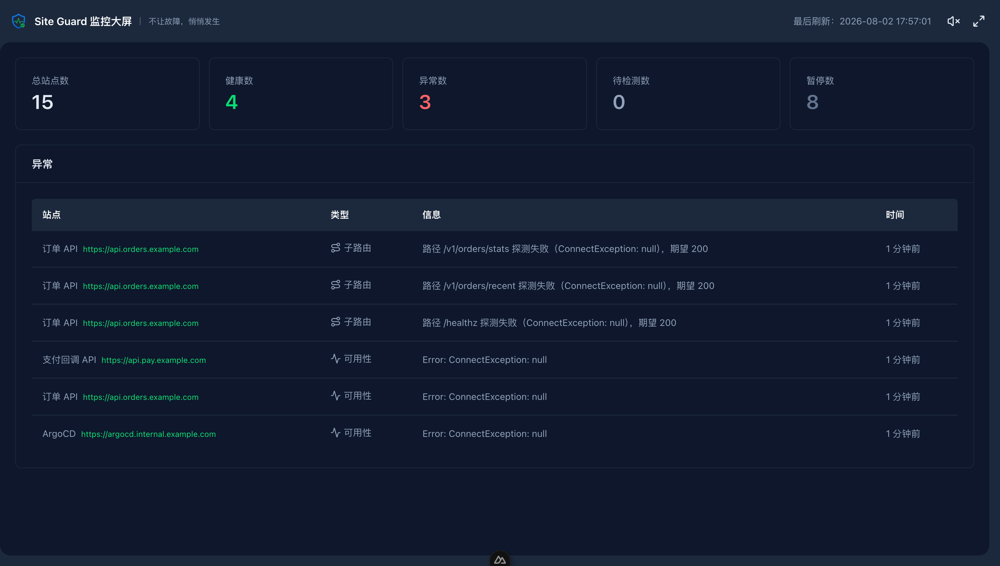
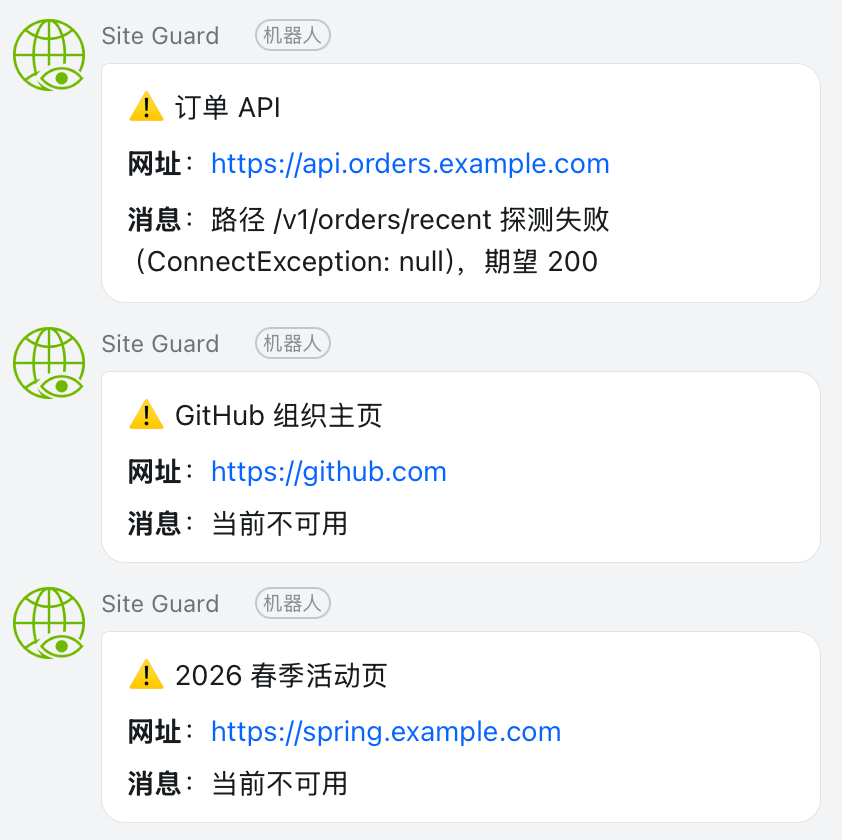

<h1 align="center">
  
  <br />
  Site Guard —— 不让故障,悄悄发生
</h1>

<p align="center">
  对站点的可用性、证书有效期、关键路径进行持续巡检。
  异常时自动推送钉钉 / 飞书 / 企业微信。
</p>

<p align="center">
  <a href="https://www.docker.com/">
    
  </a>
  <a href="https://www.java.com/">
    
  </a>
  <a href="https://nuxt.com/">
    
  </a>
</p>





## ✨ 主要功能

- **站点与分类管理** —— 自定义分类,资产一目了然。
- **可用性探活** —— HTTP 探针定时检测,自动统计总览 / 健康 / 异常 / 待检测 / 暂停。
- **证书监控** —— SSL 证书到期监控,解析剩余天数提前预警;支持对自签、过期等特定证书场景配置放行,避免误报。
- **关键路径探针** —— 在主域名之外,对 `/healthz`、`/api/orders/recent` 等关键路径做二次校验,消除"主站 200 但业务挂了"的盲区;支持关键词检测模式验证响应体;保留历次检测历史,方便回溯异常时间点。
- **告警与报告** —— 异常或恢复时按订阅规则推送钉钉、飞书、企业微信,恢复通知自带故障时间点与持续时长;每日定时推送监控日报,掌握整体趋势。
- **运维时段** —— 设定维护窗口,运维期间自动暂停监测与告警;大屏与登录页同步展示维护提示,避免噪声。
- **公开大屏** —— 只读视图,无需登录即可查看整体健康度与最近异常,适合内嵌大屏或分享给非管理员;异常时支持告警声音提醒。

<p float="left">
  
</p>

## 🚀 快速部署(Docker Compose)

```bash
git clone https://github.com/sunmh207/site-guard.git
cd site-guard
cp .env.example .env
docker compose up -d
```

访问管理后台:http://localhost:1080  (默认账号 `admin` / `admin`,首次登录后请立即修改)

## 💻 本地开发

### 后端

```bash
cd server
./gradlew bootRun
```

### 前端

```bash
cd web
pnpm install
pnpm dev
```

访问:http://localhost:3001